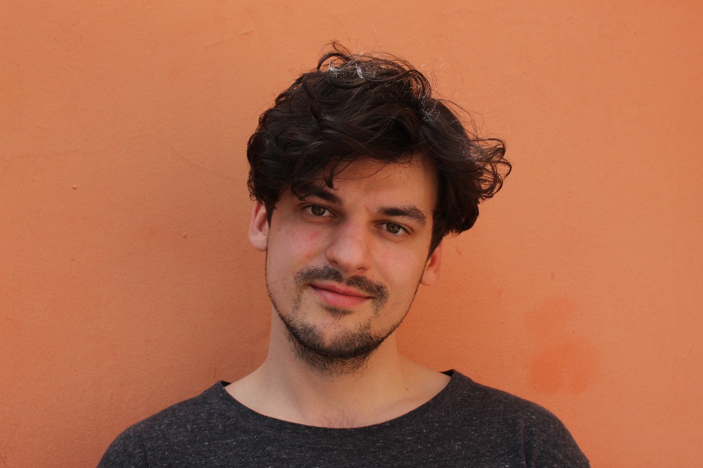

Aside {.page-break-before}
================================================================================





Contact Info {#contact}
--------------------------------------------------------------------------------

- <i class="fa fa-envelope"></i> tobias.brils@gmail.com
- <i class="fa fa-github"></i> [github.com/brilstl](https://github.com/brilstl)

code snippets {#contact}
--------------------------------------------------------------------------------

- <i class="fa fa-chalkboard-teacher"></i> [web scraping](https://brilstl.github.io/web-scraping/web-scraping-article.html)

In this article I scrape website with the use of `Docker`, `tidyverse`, `Rselenium` and `rvest`

- <i class="fa fa-chalkboard-teacher"></i> [shiny dasboard](https://tobiasbrils.shinyapps.io/state-debt/)

In this dashboard I show de state debt of European countries. The dashboard is made with `Shiny`.


Languages {#languages}
--------------------------------------------------------------------------------

```{r echo=FALSE, message=FALSE, warning=FALSE, dev='svg', fig.height = 1.5, dev.args= list (bg = 'transparent')}

library(tidyverse)

library(showtext)

font_add_google("Oswald", db_cache = F)
showtext_auto()

rate <- tibble(language = c(rep("Dutch",5), rep("English", 5)), rate = c(1:5, 1:5), pro = c(rep('yes',9), "no"))

rate %>% ggplot(aes( y = language, x = rate)) + geom_point(aes(color = pro),size = 8, alpha = .8) + theme_bw() + scale_color_manual(values = c("grey", "pink")) + labs(x = NULL, y = NULL) + theme(axis.ticks = element_blank(), axis.text.x = element_blank(), axis.line = element_blank(), panel.background = element_rect(color = "transparent", fill = "transparent"), plot.background = element_rect(color = "transparent", fill = "transparent"), panel.border = element_blank(), panel.grid = element_blank(), text = element_text(family = 'Oswald', size = 35), legend.position = "none") + xlim(c(-.5,10))

```

programmes {#programming}
--------------------------------------------------------------------------------

```{r echo=FALSE, message=FALSE, warning=FALSE, dev='svg', fig.height = 2, dev.args= list (bg = 'transparent')}


library(showtext)

font_add_google("Oswald", db_cache = F)
showtext_auto()

rate <- tibble(language = c(rep("R",5), rep("Python", 5), rep("SPSS", 5), rep("STATA", 5)), rate = c(1:5, 1:5, 1:5, 1:5), pro = c(rep('yes',4), "no", rep('yes',3), "no", "no", rep('yes',3), "no", "no",rep('yes',2), "no","no", "no")) %>% mutate(language = factor(language, levels = c("STATA", "SPSS", "Python", "R"), ordered = T))

rate %>% ggplot(aes( y = language, x = rate)) + geom_point(aes(color = pro),size = 8, alpha = .5) + theme_bw() + scale_color_manual(values = c("grey", "forestgreen")) + labs(x = NULL, y = NULL) + theme(axis.ticks = element_blank(), axis.text.x = element_blank(), axis.line = element_blank(), panel.background = element_rect(color = "transparent", fill = "transparent"), plot.background = element_rect(color = "transparent", fill = "transparent"), panel.border = element_blank(), panel.grid = element_blank(), text = element_text(family = 'Oswald', size = 35), legend.position = "none") + xlim(c(-.5,10))

```


```{r echo=FALSE, message=FALSE, warning=FALSE, dev='svg', fig.height = 2, dev.args= list (bg = 'transparent')}

# library(showtext)
# 
# font_add_google("Oswald", db_cache = F)
# showtext_auto()
# 
# tibble(lang = c(rep('dutch', 3)), pos = c(1:3), label = emojifont::fontawesome(c("fa-star", "fa-star", "fa-star")), col = c("yes", "yes", "no")) %>% ggplot(aes(y = lang, x = pos, label = label, color = col)) + scale_color_manual(values = c("grey", "pink"))+ geom_text(family='fontawesome-webfont', size = 10, alpha = .5) + theme(axis.ticks = element_blank(), axis.text.x = element_blank(), axis.line = element_blank(), panel.background = element_rect(color = "transparent", fill = "transparent"), plot.background = element_rect(color = "transparent", fill = "transparent"), panel.border = element_blank(), panel.grid = element_blank(), text = element_text(family = 'Oswald', size = 35), legend.position = "none") + labs(x = NULL, y = NULL) + xlim(c(-.5, 5))

```


Main
================================================================================
  

Tobias Brils {#title}
--------------------------------------------------------------------------------

### Currently working as a researcher at the Municipality of Amsterdam


Education {data-icon=graduation-cap data-concise=true}
--------------------------------------------------------------------------------

### Vrije Universiteit van Amsterdam

Master’s in Sociology

Amsterdam,<br>The Netherlands

2016 - 2017

Thesis: Dissecting the populist right phenomena <br> Methodology: Multilevel multinomial logistic regression

### International Association for Political Science Students

Summer course

Tirana,<br>Albania

2017

Theme: Nationalism and Democracy in Post-communist Europe


### Vrije Universiteit van Amsterdam

Pre-master Sociology

Amsterdam,<br>The Netherlands

2015 - 2016

Thesis: The march of populist right<br>Methodology: Logistic regression


### Johan Cruijff University

Bachelor Sports Marketing

Amsterdam,<br>The Netherlands

2008 - 2012

Internship: Alpe D’HuZes


Professional Experience {data-icon=suitcase}
--------------------------------------------------------------------------------

### Junior Researcher

Municipality Amsterdam

Amsterdam,<br>The Netherlands

2019 – present

<br>
Research in the field of education, segregation and inequality 

Methodology: ordinal logistic regression

In this position I use the following set of skills:

::: concise
- quantitative data analysis, 
- client relations, 
- presentation and communication
- qualitative research
:::

### Trainee researcher | data analyst

Municipality Haarlem

Haarlem,<br>The Netherlands

2018 - 2019

Reinforcing municipal policies with data driven insights

### Roaster | Barista

White Label Coffee

Amsterdam,<br>The Netherlands

2016 - 2018

Responsible for:

::: concise

- coffee production (roasting) 
- packaging 
- logistics 
- customer support

:::

### Intern marketing and communicatie

Alpe D’HuZes

Amsterdam,<br>The Netherlands

2012

Delivering a marketing and communication advisory report

### Sports trainer | coach

Turnz

Amsterdam,<br>The Netherlands

2008 - 2014

<br>
Trainer coach of 12 talented gymnasts (8-12 yo), on a national elite competition level. Accompanying and stimulating the young gymnasts to strive for their passion while having fun with it


Additional experience {data-icon=chalkboard-teacher}
--------------------------------------------------------------------------------

### Research assistant

Vrije Universiteit Amsterdam

Amsterdam,<br>The Netherlands

present

Working on a cross-country comparative research project regarding the moderation of radical populist right parties in cabinet on the political trust of party family supporters, with Dr. Jasper Muis.

### Chairman

Student association DERM

Amsterdam,<br>The Netherlands

2012

Organise a winter sports trip for 150 students, members of DERM


Publications | conference presentations {data-icon=file}
--------------------------------------------------------------------------------

### Dissecting electoral support for the far right

Paper

Amsterdam,<br>The Netherlands

2019

Tobias Brils, Teodora Gaidytė, Jasper Muis

::: concise

- Presented at the Dag van de Sociologie 
NSV 2018, Rotterdam
- Presented at the ECPR general conference 
2018, Hamburg   
- Conditionally accepted at Goverment and Opposition

:::